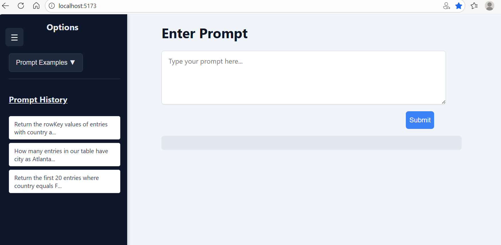

# LM-Server: Local Language Model Server

## Overview

LM-Server is a FastAPI-based local language model server that provides OpenAI-compatible API endpoints using Llama.cpp. It serves as the core inference engine for the LLM Top-Down architecture, handling text generation and chat completions with streaming support.

## Features

### 🚀 Core Capabilities
- **OpenAI-Compatible API**: Drop-in replacement for OpenAI API endpoints
- **Llama.cpp Integration**: High-performance GGUF model inference
- **Streaming Responses**: Real-time token streaming via Server-Sent Events
- **Chat Completions**: Full chat conversation support
- **Temperature Control**: Configurable response creativity
- **Context Management**: 2048 token context window

### 📡 API Endpoints

#### 🎯 **User-Friendly Chat Interface (Recommended)**
- `POST /chat` - **Complete LLM + Tool pipeline in one call**
  - Perfect for web UIs and simple integrations
  - Handles LLM inference, tool calling, and MCP-Server communication
  - Requires minimal setup - just start servers and go!

#### Basic Generation
- `POST /generate` - Single completion
- `POST /generate/stream` - Streaming completion

#### Chat Completions (OpenAI Compatible)
- `POST /v1/chat/completions` - Chat with message history
- `POST /v1/chat/completions` (stream=true) - Streaming chat

## Installation

### Prerequisites
- Python 3.8+
- GGUF model file (e.g., Llama-3.2-1B-Instruct)
- Sufficient RAM for model loading

### Dependencies
```bash
pip install fastapi llama-cpp-python uvicorn pydantic
```

### Model Setup
1. Download a GGUF model file (recommended: Llama-3.2-1B-Instruct-Q8_0)
2. Update the `MODEL_PATH` in [`main.py`](app/main.py#L10)
3. Ensure the path points to your GGUF file location

## Configuration

### Model Configuration
```python
# In app/main.py
MODEL_PATH = r"path/to/your/model.gguf"

llm = Llama(
    model_path=MODEL_PATH,
    n_ctx=2048,        # Context window size
    n_threads=8,       # CPU threads for inference
)
```

### Server Configuration
- **Host**: `localhost` (default)
- **Port**: `8000` (recommended)
- **Reload**: Enabled for development

## Usage

### Starting the Server
```bash
# From project root
cd LM-Server
uvicorn app.main:app --reload --port 8000
```

### 🎯 **Web Interface Integration**

The LM-Server includes built-in CORS configuration and a `/chat` endpoint specifically designed for web interfaces:



**Features:**
- **Zero-setup interaction**: Just type natural language questions
- **Automatic tool calling**: LLM intelligently selects and executes tools
- **Real-time responses**: Direct integration with MCP-Server
- **User-friendly**: No need to understand JSON APIs or tool schemas

**Example Interactions:**
- "Count all table entries" → Automatically calls `countTableEntities`
- "Show me 5 users from Atlanta" → Automatically calls `queryTableEntities` with proper filters
- "What are the rowKeys for Irish entries?" → Smart field selection and filtering

### API Examples

#### 🌟 **Chat Interface (Simplest)**
```bash
# Ask natural language questions - the system handles everything!
curl -X POST "http://localhost:8000/chat" \
     -H "Content-Type: application/json" \
     -d '{"input": "How many entities are in the Azure table?"}'

# Response: Complete tool execution results
{
  "response": {
    "content": [{
      "type": "text",
      "text": "The Azure Table 'mainData' contains 42 entities matching filter: 'none'."
    }]
  }
}
```

```bash
# Complex queries work seamlessly
curl -X POST "http://localhost:8000/chat" \
     -H "Content-Type: application/json" \
     -d '{"input": "Show me the first 5 records where city is Atlanta"}'
```

#### Basic Generation
```bash
curl -X POST "http://localhost:8000/generate" \
     -H "Content-Type: application/json" \
     -d '{
       "prompt": "Explain what an API is",
       "max_tokens": 100,
       "temperature": 0.7
     }'
```

#### Chat Completion (OpenAI Compatible)
```bash
curl -X POST "http://localhost:8000/v1/chat/completions" \
     -H "Content-Type: application/json" \
     -d '{
       "model": "local-llama",
       "messages": [
         {"role": "system", "content": "You are a helpful assistant."},
         {"role": "user", "content": "What is machine learning?"}
       ],
       "max_tokens": 150,
       "temperature": 0.7
     }'
```

#### Streaming Chat
```bash
curl -X POST "http://localhost:8000/v1/chat/completions" \
     -H "Content-Type: application/json" \
     -d '{
       "model": "local-llama",
       "messages": [
         {"role": "user", "content": "Tell me a story"}
       ],
       "stream": true,
       "max_tokens": 200
     }'
```

## API Reference

### Request Models

#### ChatRequest (for `/chat` endpoint)
```python
# Simple JSON request
{
    "input": "Your natural language question here"
}

# Examples:
# {"input": "How many entities are in the table?"}
# {"input": "Show me 5 records where city is Paris"}
# {"input": "Return rowKeys for entries with status active"}
```

#### GenerateRequest
```python
class GenerateRequest(BaseModel):
    prompt: str               # Input text prompt
    max_tokens: int = 128    # Maximum tokens to generate
    temperature: float = 0.7  # Response creativity (0.0-1.0)
```

#### ChatCompletionRequest
```python
class ChatCompletionRequest(BaseModel):
    model: str = "local-llama"           # Model identifier
    messages: List[ChatMessage]          # Conversation history
    max_tokens: int = 150               # Token limit
    temperature: float = 0.7            # Creativity setting
    stream: bool = False                # Enable streaming
```

#### ChatMessage
```python
class ChatMessage(BaseModel):
    role: str     # "system", "user", or "assistant"
    content: str  # Message content
```

### Response Models

#### ChatResponse (from `/chat` endpoint)
```python
{
  "response": {
    "content": [{
      "type": "text",
      "text": "The Azure Table 'mainData' contains 42 entities matching filter: 'status eq 'active''."
    }]
  }
}

# For query results:
{
  "response": {
    "content": [{
      "type": "text", 
      "text": "{\"table\": \"mainData\", \"entities\": [{...}], \"resultCount\": 5}"
    }]
  }
}
```

#### GenerateResponse
```python
{
  "text": "Generated response text..."
}
```

#### ChatCompletion
```python
{
  "id": "chatcmpl-unique-id",
  "object": "chat.completion",
  "created": 1703097600,
  "model": "local-llama",
  "choices": [{
    "index": 0,
    "message": {
      "role": "assistant",
      "content": "Response content..."
    },
    "finish_reason": "stop"
  }],
  "usage": {
    "prompt_tokens": 20,
    "completion_tokens": 50,
    "total_tokens": 70
  }
}
```

## File Structure

```
LM-Server/
├── app/
│   ├── main.py           # FastAPI application
│   ├── mcp_client.py     # MCP client integration
│   └── __pycache__/      # Python cache
├── notes/
│   ├── OpenAICompatible.md  # OpenAI API documentation
│   └── SSE-Notes.md         # Server-Sent Events notes
├── test/
│   ├── run.py            # Test runner
│   └── test.py           # Unit tests
└── README.md             # This file
```

## OpenAI Compatibility

This server implements OpenAI's Chat Completions API format, making it compatible with:
- OpenAI Python SDK
- LangChain
- Other tools expecting OpenAI API format

See [`notes/OpenAICompatible.md`](notes/OpenAICompatible.md) for detailed API mapping.

## Performance Considerations

### Model Selection
- **1B models**: Fast inference, good for development
- **3B models**: Balanced performance and quality
- **7B+ models**: Higher quality, requires more RAM

### Optimization Tips
- Use quantized models (Q4_0, Q8_0) for speed
- Adjust `n_threads` based on CPU cores
- Consider GPU acceleration for larger models

## Development

### Testing
```bash
# Run tests
cd test
python test.py

# Manual testing
python run.py
```

### Adding New Endpoints
1. Define request/response models
2. Implement endpoint logic in [`main.py`](app/main.py)
3. Add appropriate documentation
4. Test with various inputs

## Troubleshooting

### Common Issues

1. **Model Loading Errors**
   - Verify GGUF file path
   - Check available RAM
   - Ensure model file isn't corrupted

2. **Slow Inference**
   - Reduce `max_tokens`
   - Increase `n_threads`
   - Use smaller quantized model

3. **API Compatibility Issues**
   - Check request format matches OpenAI spec
   - Verify Content-Type headers
   - Review error logs

### Monitoring
- Check server logs for errors
- Monitor memory usage during inference
- Use FastAPI's automatic documentation at `/docs`

## Integration

This server integrates with:
- **🎯 Web Applications**: **Primary integration via `/chat` endpoint** - requires minimal setup
- **MCP-Server**: Direct integration for tool execution (when using `/chat`)
- **MCP-Client**: Provides LLM responses for tool calling (alternative architecture)
- **External Tools**: Any OpenAI-compatible client via `/v1/chat/completions`
- **Custom Applications**: Via any of the REST API endpoints

### Integration Architectures

#### **Recommended: Direct Web Integration**
```
Web UI → LM-Server (/chat) → MCP-Server → Azure Table
```
- ✅ Simplest setup
- ✅ Single endpoint handles everything
- ✅ Built-in error handling
- ✅ Natural language interface

#### **Advanced: Modular Architecture**
```
Client → LM-Server (/v1/chat/completions) → MCP-Client → MCP-Server → Azure Table
```
- 🔧 More complex setup
- 🔧 Better for custom tool orchestration
- 🔧 Requires separate client implementation

## Contributing

When modifying LM-Server:
1. Maintain OpenAI API compatibility
2. Update type hints and validation
3. Test both streaming and non-streaming modes
4. Document any configuration changes

---

**Next Steps**: Configure the server and test with the MCP-Client for full system integration.